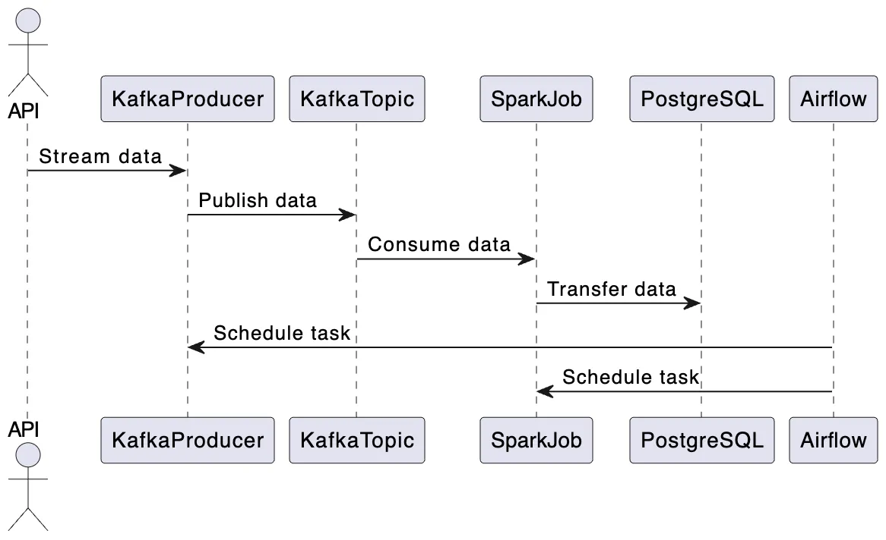

# Real-Time Data Pipeline: Kafka → Spark → PostgreSQL

A comprehensive end-to-end data engineering project demonstrating real-time data streaming, distributed processing, and workflow orchestration. This project is split into two phases: **Phase 1** focuses on building a robust data pipeline, while **Phase 2**  will develop LLM-powered applications that interact with the database.

**Technologies:** Apache Kafka, Apache Spark, Apache Airflow, PostgreSQL, Python, Docker Compose

---

## 📋 Project Overview

This project demonstrates a production-grade data pipeline architecture that processes real-time data from APIs through multiple transformation stages:

### **Phase 1: Data Pipeline (Current)**
The first phase guides you through constructing a complete data pipeline utilizing:
- **Kafka** for real-time data streaming
- **Airflow** for workflow orchestration and scheduling
- **Spark** for distributed data transformation
- **PostgreSQL** for persistent storage
- **Docker Compose** for containerized deployment

### **Phase 2: LLM Applications (Upcoming)**
The second phase will delve into creating intelligent agents using frameworks like **LangChain** to communicate with and query the database intelligently.

---

## 🎯 Target Audience

This project is ideal for:
- **Beginners in Data Engineering** - Learn fundamental concepts with hands-on implementation
- **Data Scientists & ML Engineers** - Deepen your understanding of data handling pipelines and production-grade systems
- **Anyone Building LLM Applications** - Understand how to construct a robust data foundation for AI/ML models

---

## 🔄 Data Pipeline Architecture

The pipeline follows a three-stage process:

### **1. Data Streaming**
- Data is ingested from external APIs
- Real-time events are published to Kafka topics
- Kafka acts as the central event hub for data distribution

### **2. Data Processing**
- Apache Spark consumes messages from Kafka topics
- Data is transformed, cleaned, and enriched
- Processed data is loaded into PostgreSQL database
- Spark handles distributed processing for scalability

### **3. Scheduling with Airflow**
- Apache Airflow orchestrates both streaming and processing tasks
- DAGs define workflows and dependencies
- Automated daily scheduling ensures consistent data updates
- In production, Kafka producer runs continuously; for demo purposes, tasks run on schedule
- Processed data is ready for downstream LLM applications

### **Architecture Diagram**



```
API → Kafka (Event Hub) → Spark (Processing) → PostgreSQL (Data Store)
                              ↓
                          Airflow (Orchestration)
```

---

## 🚀 Quick Start

### Prerequisites
- Docker & Docker Compose installed
- Python 3.8+
- Git

### Installation & Setup

```bash
# Clone the repository
git clone https://github.com/praneetha-meda/data-pipeline-kafka-spark-airflow.git
cd data-pipeline-kafka-spark-airflow

# Start all services with Docker Compose
docker-compose -f docker-compose.yml up -d

# For Airflow services
docker-compose -f docker-compose-airflow.yaml up -d

# Verify services are running
docker ps
```

### Project Structure
```
.
├── airflow_resources/          # Airflow DAGs and configurations
│   ├── dags/
│   │   └── dag_kafka_spark.py # Main orchestration DAG
│   └── Dockerfile             # Airflow container configuration
├── src/                        # Source code
│   ├── kafka_client/           # Kafka producers and consumers
│   │   ├── kafka_stream_data.py
│   │   └── transformations.py
│   └── spark_pgsql/            # Spark to PostgreSQL pipeline
│       └── spark_streaming.py
├── spark/                      # Spark job resources
│   └── Dockerfile
├── scripts/                    # Utility scripts
│   └── create_table.py        # Database initialization
├── data/                       # Data files and state
├── docker-compose.yml          # Main Docker Compose configuration
└── docker-compose-airflow.yaml # Airflow-specific services
```

---

## 🛠️ Technical Details

### Key Components

**Apache Kafka**
- Message broker for real-time data streaming
- Decouples data sources from processing systems
- Ensures reliable, scalable data ingestion

**Apache Spark**
- Distributed computing framework
- Handles large-scale data transformation
- Optimized for both batch and streaming workloads

**Apache Airflow**
- Workflow orchestration and scheduling
- DAG-based task management
- Monitoring and error handling

**PostgreSQL**
- Relational database for structured data storage
- Reliable persistence layer
- Support for complex queries and analytics

**Docker Compose**
- Multi-container application orchestration
- Simplified local development and testing
- Production-like environment

---

## 📚 Learning Outcomes

By completing this project, you'll understand:
- ✅ How to set up real-time data pipelines
- ✅ Event streaming with Kafka
- ✅ Distributed data processing with Spark
- ✅ Workflow orchestration with Airflow
- ✅ Containerized application deployment
- ✅ Data transformation and loading (ETL) patterns
- ✅ Foundation for building LLM-powered data applications

---

## 📖 Documentation

For a detailed step-by-step guide and explanations:
- [Add your blog/article link here]

For detailed understanding of tool internals and theory, refer to official documentation:
- [Apache Kafka Documentation](https://kafka.apache.org/documentation/)
- [Apache Spark Documentation](https://spark.apache.org/documentation.html)
- [Apache Airflow Documentation](https://airflow.apache.org/docs/)
- [PostgreSQL Documentation](https://www.postgresql.org/docs/)

---

## 🔮 What's Next (Phase 2)

The upcoming second phase will demonstrate:
- Building intelligent data agents with LangChain
- Creating conversational interfaces to query the database
- Integrating LLMs with the data pipeline
- Advanced retrieval and analysis patterns

---

## 📝 License

This project is licensed under the MIT License - see the LICENSE file for details.

---

## 🤝 Contributing

Contributions are welcome! Feel free to submit pull requests or open issues for improvements and discussions.

---

**Ready to dive in?** Start with the prerequisites and Quick Start section above. Happy data engineering! 🎉
